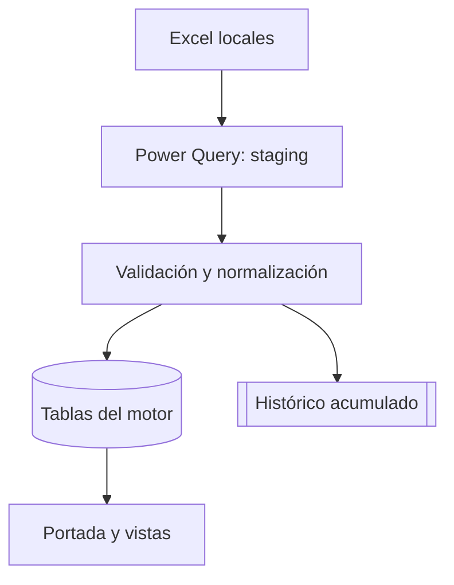

# Propuesta V1 — ControlOps 360

## Decisión de diseño

Sí es posible unificar el proceso en un solo Excel. La forma estable es usar un **libro controlador** que se conecta a los archivos locales, conserva las fuentes como solo lectura y almacena únicamente los acumulados autorizados.

El archivo maestro no debe copiar hojas completas ni depender de posiciones como `AC`, `AD` o `AE`. Cada integración debe apuntar a una **Tabla de Excel con nombre estable**. Así pueden cambiar el orden visual, filtros o tablas dinámicas sin romper el motor.

## Flujo operativo

1. El gerente actualiza los reportes locales con su proceso actual.
2. Abre `ControlOps360.xlsm` y pulsa **Actualizar motor**.
3. Power Query refresca las tablas de entrada.
4. VBA espera a que terminen las conexiones.
5. Se valida estructura, periodo, tienda y duplicados.
6. Solo `tHistoricoInventario` recibe filas nuevas.
7. Las salidas se recalculan y el motor registra fecha, duración y resultado.
8. Todas las hojas técnicas vuelven a `VeryHidden`; queda visible `PORTADA`.

## Arquitectura

## Regla principal: base de 21 días

- Se consulta, pero no se edita.
- No se usa como histórico permanente.
- Cada corte se identifica por tienda, fecha y artículo.
- El acumulado agrega solo llaves que no existen.
- Si una corrida se repite, el número de filas nuevas debe ser cero.

## Capas del libro maestro

| Capa | Ejemplos | Visibilidad |
| --- | --- | --- |
| Operación | `PORTADA` | Visible |
| Salidas | `V_AUDITORIA`, `V_INVENTARIO`, `V_MAXMIN`, `V_PEAK`, `V_BA` | Se muestran desde la portada |
| Staging | `_RAW_AUDITORIA`, `_RAW_INV21`, `_RAW_MAXMIN`, `_RAW_PEAK`, `_RAW_BA` | VeryHidden |
| Modelo | `_MOTOR_NORMALIZADO`, `_HIST_INV`, `_CFG`, `_LOG` | VeryHidden |

`VeryHidden` evita que el usuario muestre las hojas desde el menú normal. Es control de interfaz, no seguridad criptográfica; los permisos del archivo y la carpeta siguen siendo necesarios.

## Reglas por módulo

### Auditoría Tienda

- Señala cualquier transacción con cantidad o importe menor que cero.
- Conserva CeCo, fecha, transacción, concepto, usuario y valor.
- No corrige el dato; crea una lista de revisión con motivo.

### Histórico Inventario

- Uso, merma y variación se normalizan en una sola estructura.
- El histórico es append-only.
- Llave sugerida: `CeCo|FechaCorte|CodigoArticulo|Metrica`.

### Máx & Mín

- Mantiene `Pick Pack` y `Unidad` como dos modos del mismo artículo.
- Columnas mínimas: artículo, empaque, uso promedio, mínimo, máximo y número de pedidos.
- La conversión requiere el factor de empaque oficial; no se infiere del texto.

### Peak Hour 2.0

- Conserva `Dashboard_PeakHour` y `Foco_PH` como fuentes.
- Normaliza semana, día, franja de 30 minutos, transacciones y periodo foco.

### Normalizados

- El extractor conserva únicamente las bases móviles de 20 días: `Detalle_CB` y `detallevaso`.
- Los históricos `historicocb` y `historicovaso` viven fuera del extractor para evitar que el libro crezca en cada actualización.
- Las reglas de negocio se mantienen en `tbl_normalizado_crema.xlsx` y `tbl_normalizado_vaso.xlsx`.
- Las vistas `Tamanos`, `Vaso&Tapa` y `Crema Batida` consumen los históricos validados; no abren conexiones SQL propias.

## Controles mínimos antes de publicar

- Archivo encontrado y accesible.
- Tabla y columnas obligatorias presentes.
- CeCo único o explícitamente seleccionado.
- Fecha de corte válida y no futura.
- Base de 21 días dentro de la ventana esperada.
- Sin llaves duplicadas en el lote.
- Conteos antes, nuevos, omitidos y después reconciliados.
- Copia de respaldo del maestro antes de anexar histórico.

## Resultado esperado

Un solo punto de entrada para el gerente de tienda, con trazabilidad de cada actualización y sin necesidad de navegar entre hojas técnicas. El proyecto web puede consumir las tablas normalizadas más adelante sin cambiar la captura en Excel.
